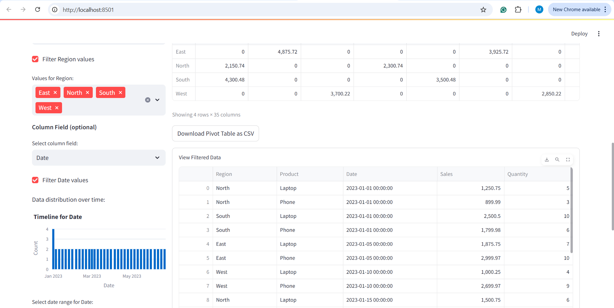

# CSV Pivot Table Viewer



A powerful and interactive tool for exploring and analyzing CSV data through dynamic pivot tables, right in your browser. Think of it as a standalone version of Excel's pivot table functionality but with real-time updates and visual filtering.

## ✨ Features

- **Data Loading & Preview**
  - Load CSV files through upload or use the included sample data
  - Preview your data with expandable/collapsible sections

- **Interactive Filtering**
  - Filter data with intuitive controls tailored to each data type:
    - 📊 **Numbers**: Range sliders with min/max values
    - 📋 **Categories**: Multi-select dropdown lists
    - 📅 **Dates**: Visual timeline charts with histograms and date range selection
  - See filtered data preview and row count statistics in real-time

- **Dynamic Pivot Tables**
  - Real-time table generation - see results instantly as you change:
    - Row fields (what to group by)
    - Column fields (optional secondary grouping)
    - Value fields (what to measure - select multiple!)
    - Aggregation methods (sum, average, count, min, max)
  - Analyze multiple metrics simultaneously with multi-value support
  - Export pivot tables to CSV with one click

## 🖥️ Screenshots

> **Note:** Add your own screenshots of the running application here!

### Main Interface
(Screenshot showing the main interface with data loaded)

### Date Timeline Filter
(Screenshot showing the timeline chart with date filter)

### Multiple Value Fields
(Screenshot showing multiple value fields in the pivot table)

## 🚀 Installation

### Prerequisites
- Python 3.6+
- Required Python packages:
  ```
  pandas
  numpy
  streamlit
  plotly
  ```

### Setup
1. Clone this repository:
   ```bash
   git clone https://github.com/yourusername/csv-pivot-viewer.git
   cd csv-pivot-viewer
   ```

2. Install dependencies:
   ```bash
   pip install -r requirements.txt
   ```

## 📊 Usage

1. Launch the web application:
   ```bash
   streamlit run csv_pivot_web.py
   ```

2. Open your browser to the URL shown in the terminal (typically http://localhost:8501)

3. Upload a CSV file or use the included sample data

4. Configure your pivot table:
   - Select row and column fields for grouping data
   - Choose one or more value fields to analyze
   - Apply filters by checking the filter boxes next to field names
   - Select an aggregation method (sum, mean, count, min, max)

5. Watch the pivot table update automatically as you make selections

6. Download your results as CSV using the download button

## 📊 Sample Data

The repository includes sample sales data (`sample_data.csv`) with:
- Regional data (North, South, East, West)
- Product categories (Laptop, Phone)
- Time series data spanning six months
- Sales amounts and quantities

This allows you to create various pivot views like:
- Total sales by region
- Quantity sold by product and region
- Monthly sales trends
- Average, minimum, or maximum values across categories

## 🧪 Example Analysis Scenarios

1. **Regional Sales Comparison**
   - Row: Region
   - Values: Sales, Quantity
   - See which regions are performing best in both revenue and units

2. **Product Performance Over Time**
   - Row: Date
   - Column: Product
   - Values: Sales
   - Track how each product's sales change over time

3. **Regional Product Mix**
   - Row: Region
   - Column: Product
   - Values: Quantity
   - Understand which products are popular in different regions

## 📝 License

This project is licensed under the MIT License - see the LICENSE file for details.

## 🙏 Acknowledgments

- Built with [Streamlit](https://streamlit.io/)
- Data visualization powered by [Plotly](https://plotly.com/)
- Data processing using [pandas](https://pandas.pydata.org/)